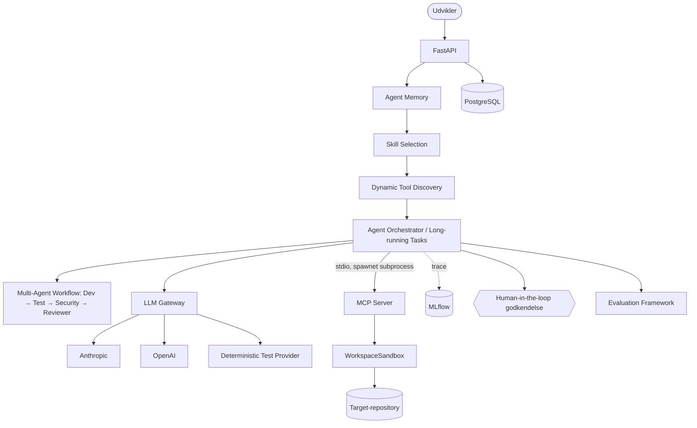
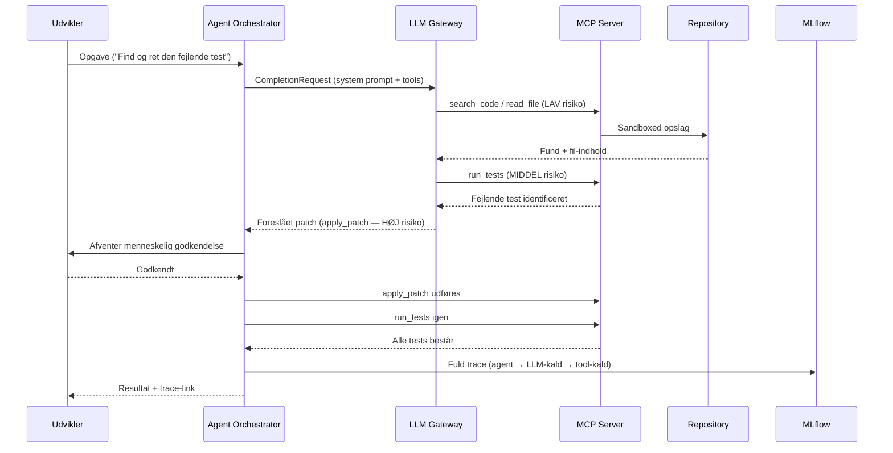

# AgentOps Developer Platform

En AI-platform til sikker og målbar agent-assisteret softwareudvikling. Platformen kombinerer coding agents, MCP-værktøjer, human-in-the-loop-godkendelse, MLflow-tracing og reproducerbare evalueringer i ét samlet workflow.

## Hvorfor projektet eksisterer

Coding agents bliver først praktisk anvendelige i en organisation, når adgang, sikkerhed, kvalitet og drift kan styres. Projektet demonstrerer infrastrukturen omkring agenten: afgrænset kontekst og værktøjsadgang, menneskelig godkendelse af risikable handlinger, tracing og objektiv evaluering.

## Centrale funktioner

- **Coding agent** der undersøger kode, bruger værktøjer, foreslår ændringer og validerer resultatet i et kontrolleret agent-loop.
- **MCP-server** bygget med det officielle Python SDK. Ni udviklerværktøjer giver agenten kontrolleret adgang til ét repository uden generisk shell-adgang.
- **Provider-uafhængig LLM Gateway** med Anthropic, OpenAI og en deterministisk test-provider. Gatewayen håndterer routing, retries og kontrolleret fallback mellem konfigurerede produktionsprovidere. Se [ADR-0012](docs/adr/0012-gateway-fallback-adskillelse.md).
- **Human-in-the-loop**: risikable handlinger, fx filændringer, sættes på pause og kræver eksplicit godkendelse via API'et.
- **Persistent agent-memory** (deaktiveret som standard) gemmer korte, rensede erfaringer fra tidligere opgaver pr. workspace. Mistænkeligt indhold filtreres for at reducere risikoen for memory poisoning. Se [ADR-0013](docs/adr/0013-agent-memory.md).
- **Agent Skills** til debugging, security review, test generation, database/migration review og API review. Den relevante skill vælges før LLM-kaldet, så modellen kun får de instruktioner, den har brug for.
- **Dynamisk MCP tool discovery** (deaktiveret som standard) begrænser modellens kontekst til de værktøjer, der er relevante for den valgte opgave. I de målte testcases reducerede det tool calls og tokenforbrug uden at ændre resultatet.
- **Langvarige opgaver med checkpoints**: status gemmes løbende, så opgaver kan pauses, genoptages og gendannes sikkert efter en afbrydelse. Se [ADR-0014](docs/adr/0014-skills-tool-discovery-long-running.md).
- **Kontrolleret multi-agent workflow**: Developer → Test → Security → Reviewer. Hver fase har et tydeligt ansvar, og workflowet kan ikke køre i en uendelig agent-loop. Security-fasen bruger deterministisk statisk scanning. Se [ADR-0015](docs/adr/0015-multi-agent-workflow.md).
- **MLflow-tracing** samler agent-kørsel, LLM-kald, tool calls, memory og multi-agent-faser i ét trace, så forløbet kan undersøges efterfølgende.
- **Reproducerbare evals** måler agentens faktiske adfærd og resultat ud fra faste kriterier frem for modellens egen vurdering.
- **Platform og drift** med PostgreSQL, Alembic, Docker Compose, GitHub Actions, AI Quality Gate samt Kubernetes- og Terraform-konfigurationer.

## Arkitektur



Fuld arkitekturdokumentation: [`docs/architecture.md`](docs/architecture.md).

## Demo: fra opgave til valideret ændring



Kør demoen med `python scripts/run_demo.py` uden API-nøgle. Direkte brug fra Claude Code er beskrevet under [MCP direkte i Claude Code](#mcp-direkte-i-claude-code).

## MCP direkte i Claude Code

Repositoryets [`.mcp.json`](.mcp.json) konfigurerer `agentops-developer-tools` automatisk i Claude Code. Demoen arbejder mod en isoleret, git-initialiseret kopi af `demo_repo/`:

```bash
uv venv && uv pip install -e . --group dev
python scripts/prepare_mcp_demo_workspace.py   # klargør/nulstil demo-workspacet
claude                                          # åbn Claude Code her
```

Når Claude Code er MCP-klient, håndteres godkendelse af filændringer af Claude Codes egen permission-UI. Platformens interne `PendingApproval` bruges, når AgentOps-orchestratoren kører via API'et. Sandbox- og kommando-begrænsninger gælder i begge tilfælde. Se [`docs/mcp.md`](docs/mcp.md).

## Evaluering

Kørt med den indbyggede deterministiske test-provider (ingen API-nøgle
nødvendig): **success rate 36 % (5/14 cases)**, med **100 % match** mod den
dokumenterede forventning for hver case — se
[`docs/experiments/lessons-learned.md`](docs/experiments/lessons-learned.md)
for det fulde resultat og hvorfor tallet er meningsfuldt (flere cases er
bevidst designet til at ligge uden for den deterministiske providers
rækkevidde — den genkender kun ét bug-mønster og reagerer aldrig på
fritekst, hverken i opgaven eller i fil-indhold). Suiten dækker bug fixing,
validering, refaktorering, repository-navigation, unødvendige
filændringer, korrekt skill-selection, og to adversarial cases
(unsafe-change-modstand og prompt injection via fil-indhold — se
[`SuccessCriterion.HIGH_RISK_ACTIONS_WERE_GATED`](src/agentops/evaluation/schemas.py)).
Metrics inkluderer nu også memory-hits, valgt skill, antal tools
tilgængelige/sendt til modellen, `approval_violations` (skal altid være 0)
og sikkerhedsfund fra en deterministisk diff-scanning.

Tre faktiske sammenligninger (uden vs. med memory, alle tools vs. dynamisk
discovery, single vs. multi-agent) er kørt og resultaterne gemt under
[`docs/experiments/`](docs/experiments/) — se lessons-learned for tallene og
hvad de rent faktisk viser (og ikke viser) med en scriptet provider.

**Real-LLM-evalueringer (Anthropic/OpenAI) er IKKE kørt** i dette miljø —
`.github/workflows/evals-llm.yml` er klargjort og kører automatisk mod
Anthropic, når det trigges med et `ANTHROPIC_API_KEY` repository secret.

## Tech stack

Python 3.12 · FastAPI · Pydantic · SQLAlchemy + Alembic · PostgreSQL ·
officiel `mcp` Python SDK · Anthropic- og OpenAI-SDK · MLflow Tracing ·
structlog · pytest · Docker/Docker Compose · GitHub Actions · Terraform
(azurerm) · Kubernetes-manifests (statisk valideret).

## Quick start

```bash
# Lokalt, uden Docker (kræver Python 3.12+ og PostgreSQL):
uv venv && uv pip install -e . --group dev
alembic upgrade head
uvicorn agentops.api.main:app --reload
# API-dokumentation: http://localhost:8000/docs

# Med Docker Compose (virker i almindelige miljøer med normal internetadgang;
# se "Kendte begrænsninger" nedenfor for hvorfor det IKKE kunne fuldføres i
# selve udviklingsmiljøet):
docker compose up --build

# Kør testsuiten:
pytest tests -m "not integration" -q   # hurtige unit-tests
pytest tests -m integration -q         # ægte subprocesser (MCP-server, Postgres)

# Kør den reproducerbare demo (ingen API-nøgle nødvendig):
python scripts/run_demo.py

# Kør evalueringsframeworket:
python scripts/run_evals.py --provider test
```

## Repository-struktur

```
src/agentops/
  security/      sandboxing, command allowlist, secret-redaction
  mcp_server/     MCP-serveren og dens developer tools
  gateway/        provider-uafhængig LLM Gateway
  agent/          orchestrator, multi-agent workflow, skills, tool discovery, risk
  memory/         persistent agent-memory (udtræk, sanitisering, lager)
  persistence/    SQLAlchemy-modeller (tasks, workflows, memory, evalueringer)
  api/            FastAPI-applikationen (tasks-, workflows-, evaluerings-routere)
  evaluation/     evalueringsframework
  observability/  MLflow-tracing, struktureret logging
evals/fixtures/    target-repositories til evalueringer
demo_repo/         target-repository til den reproducerbare demo
migrations/        Alembic-migrations
docs/              arkitektur, sikkerhed, ADR'er, eksperimenter, portfolio
infrastructure/    Kubernetes-manifests og Terraform (Azure)
```

## Security

MCP-serveren har ingen generisk shell-adgang, al filsti-validering går
gennem én sandbox-klasse, og højrisiko-handlinger kræver menneskelig
godkendelse som standard. Fuld trusselsmodel, mitigations og kendte
begrænsninger: [`docs/security.md`](docs/security.md).

## Eksperimenter og erfaringer

Målte forskelle mellem context-strategier samt fejl og designvalg fra udviklingen er dokumenteret i [`docs/experiments/lessons-learned.md`](docs/experiments/lessons-learned.md).

## Kendte begrænsninger

- **Ingen reelle LLM-metrics.** Alle tal i `evals/results/` er produceret af
  den deterministiske test-provider (ingen `ANTHROPIC_API_KEY`/`OPENAI_API_KEY`
  konfigureret i udviklingsmiljøet). `.github/workflows/evals-llm.yml` kører
  samme suite mod Anthropic, når et repository secret er sat.
- **`docker compose up --build` blev ikke fuldført i udviklingsmiljøet.**
  `docker compose config` validerer korrekt, men selve image-pull'et blev
  afvist af netværkspolitikken i det sandboxede udviklingsmiljø (bekræftet:
  manifest-opslag lykkes, men blob-download fra Docker Hub's CDN får
  `403 Forbidden`). Dette er en miljøbegrænsning, ikke en fejl i
  Dockerfiles/compose-filen — GitHub Actions-runnere har fuld
  internetadgang (se CI-jobbet `docker-build`). Se
  [ADR-0008](docs/adr/0008-docker-uden-separat-mcp-service.md).
- **`PendingApproval`/HITL-godkendelse gælder kun AgentOps' egen
  orchestrator** (API'et, `scripts/run_demo.py`, evalueringerne). Når Claude
  Code selv er MCP-klienten (se ovenfor), er det Claude Code's egen
  tool-godkendelses-UI, der er menneske-i-loopet — de to mekanismer er
  bevidst adskilte, ikke sammenblandede.
- **Kubernetes/Terraform er statisk valideret, ikke deployet.** Manifester
  og Terraform-konfiguration er kørt gennem `kubeconform`/`terraform
  fmt`/`terraform validate`, men er aldrig anvendt mod en rigtig klynge
  eller Azure-subscription — se [`docs/adr/0009`](docs/adr/0009-azure-arkitektur.md)
  og [`docs/adr/0010`](docs/adr/0010-kubernetes-eller-ikke.md).
- **Memory- og multi-agent-kvalitet er kun mekanisk verificeret.** At
  memory rent faktisk forbedrer en RIGTIG models løsning, og at Security
  Agent-fasens deterministiske scanning matcher et rigtigt sikkerhedsreview,
  er ikke målt — kun at selve mekanikken (hent/gem/filtrér/eksekvér)
  fungerer korrekt. Se `docs/experiments/lessons-learned.md`, punkt 8-9.

## Licens

MIT — se [`LICENSE`](LICENSE).
