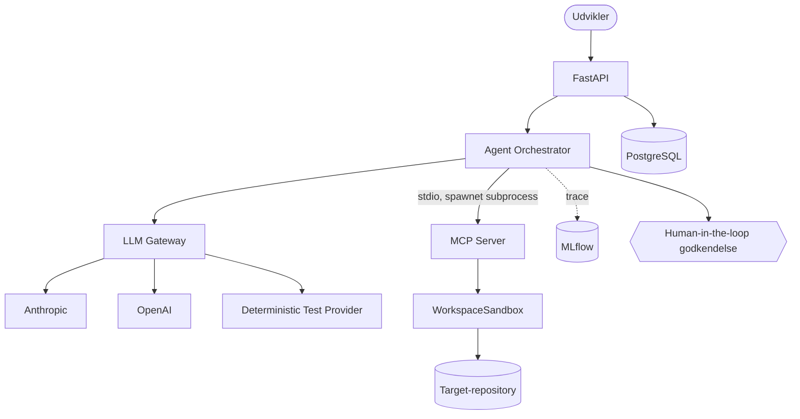

# AgentOps Developer Platform

En observerbar og evaluerbar AI-platform til agent-assisteret
softwareudvikling: en coding agent, der løser softwareopgaver ved at
undersøge og ændre et repository gennem en rigtig MCP-server — med
kontrolleret context, human-in-the-loop-godkendelse af risikable handlinger,
MLflow-tracing og et reproducerbart evalueringsframework.

## Hvorfor projektet eksisterer

Coding agents kan være effektive, men enterprise-brug kræver mere end en
model, der kan skrive kode: kontrolleret context (ikke hele repoet i
prompten), afgrænset tool-adgang, observability på tværs af agent-kørsler,
et evalueringsframework der måler faktisk succes frem for antagelser, og
sikker integration i en softwareudviklingsproces med menneskelig kontrol
over risikable handlinger. Dette projekt bygger den infrastruktur.

## Centrale funktioner

- **Coding agent orchestrator** med en agentisk løkke, strukturerede
  (ikke skjulte) beslutninger, og fire eksplicitte context-strategier.
- **Rigtig MCP-server** (officiel `mcp` Python SDK) med ni developer tools,
  sandboxed til ét repository, path traversal-beskyttet, med en command
  allowlist — ingen generisk shell-adgang.
- **Provider-uafhængig LLM Gateway**: Anthropic, OpenAI, og en deterministisk
  test-provider (kører uden API-nøgle), med routing, retries og fallback.
- **Human-in-the-loop-godkendelse**: højrisiko tool-kald (fil-ændringer)
  pauser agenten og kræver eksplicit godkendelse via API'et.
- **MLflow-tracing** af hele kæden: agent-kørsel → LLM-kald → tool-kald.
- **Reproducerbart evalueringsframework** med deterministiske
  success-kriterier — ikke en models egen selvvurdering.
- **PostgreSQL + Alembic-migrations**, Docker/Docker Compose, GitHub Actions
  CI med et separat "AI Quality Gate", og statisk validerede
  Kubernetes/Terraform-konfigurationer.

## Arkitektur



Fuld arkitekturdokumentation: [`docs/architecture.md`](docs/architecture.md).

## Eksempel på workflow

```
Developer task ("Find og ret den fejlende test")
   ↓
Agent undersøger repository via MCP tools
   ↓
Agent foreslår en patch (apply_patch — høj risiko)
   ↓
Menneskelig godkendelse
   ↓
Patch anvendes, tests køres igen
   ↓
Resultat + fuld trace tilgængelig via API'et
```

Kør selv: `python scripts/run_demo.py` (kræver ingen API-nøgle).

## Evaluering

Kørt med den indbyggede deterministiske test-provider (ingen API-nøgle
nødvendig): **success rate 25 % (1/4 cases)**, med 100 % match mod den
dokumenterede forventning for hver case — se
[`docs/experiments/lessons-learned.md`](docs/experiments/lessons-learned.md)
for hvorfor det tal er meningsfuldt (nogle cases er bevidst designet til at
være uden for test-providerens rækkevidde). **Real-LLM-evalueringer
(Anthropic/OpenAI) er IKKE kørt** i dette miljø — workflow'et
(`.github/workflows/evals-llm.yml`) er klargjort, men kræver en API-nøgle.

## Tech stack

Python 3.12 · FastAPI · Pydantic · SQLAlchemy + Alembic · PostgreSQL ·
officiel `mcp` Python SDK · Anthropic- og OpenAI-SDK · MLflow Tracing ·
structlog · pytest · Docker/Docker Compose · GitHub Actions · Terraform
(azurerm) · Kubernetes-manifests (statisk valideret).

## Quick start

```bash
# Lokalt, uden Docker (kræver Python 3.12+ og PostgreSQL):
uv venv && uv pip install -e . --group dev
alembic upgrade head
uvicorn agentops.api.main:app --reload
# API-dokumentation: http://localhost:8000/docs

# Med Docker Compose (kræver Docker; se docs/adr/0008 for en kendt
# netværksbegrænsning i sandboxede miljøer under selve udviklingen af dette
# projekt — virker i almindelige miljøer):
docker compose up --build

# Kør testsuiten:
pytest tests -m "not integration" -q   # hurtige unit-tests
pytest tests -m integration -q         # ægte subprocesser (MCP-server, Postgres)

# Kør den reproducerbare demo (ingen API-nøgle nødvendig):
python scripts/run_demo.py

# Kør evalueringsframeworket:
python scripts/run_evals.py --provider test
```

## Repository-struktur

```
src/agentops/
  security/      sandboxing, command allowlist, secret-redaction
  mcp_server/     MCP-serveren og dens developer tools
  gateway/        provider-uafhængig LLM Gateway
  agent/          coding agent orchestrator, risk, context-strategier
  persistence/    SQLAlchemy-modeller
  api/            FastAPI-applikationen
  evaluation/     evalueringsframework
  observability/  MLflow-tracing, struktureret logging
evals/fixtures/    target-repositories til evalueringer
demo_repo/         target-repository til den reproducerbare demo
migrations/        Alembic-migrations
docs/              arkitektur, sikkerhed, ADR'er, eksperimenter, portfolio
infrastructure/    Kubernetes-manifests og Terraform (Azure)
```

## Security

MCP-serveren har ingen generisk shell-adgang, al filsti-validering går
gennem én sandbox-klasse, og højrisiko-handlinger kræver menneskelig
godkendelse som standard. Fuld trusselsmodel, mitigations og kendte
begrænsninger: [`docs/security.md`](docs/security.md).

## Eksperimenter og lessons learned

Faktisk målte forskelle mellem context-strategier, og en ærlig gennemgang af
hvad der ikke virkede første gang under udviklingen:
[`docs/experiments/lessons-learned.md`](docs/experiments/lessons-learned.md).

## Licens

MIT — se [`LICENSE`](LICENSE).
