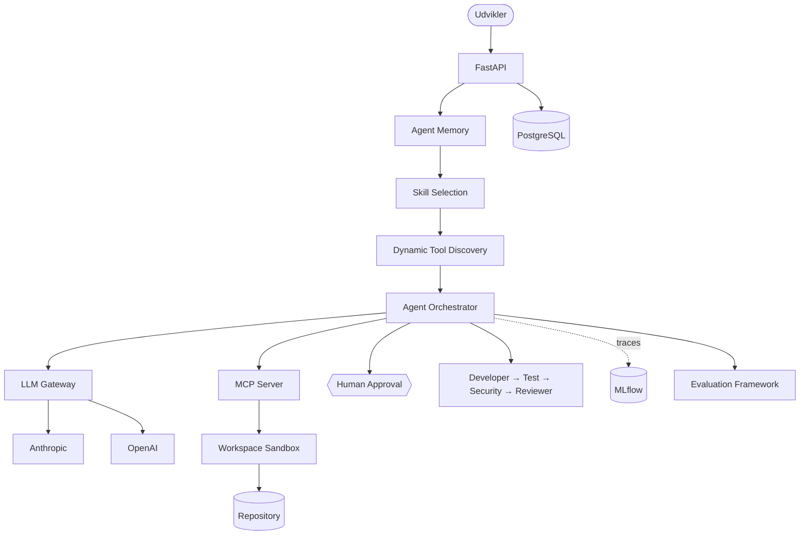

# AgentOps Developer Platform

En AI-platform til agent-assisteret softwareudvikling, bygget som et praktisk eksperiment i, hvordan coding agents kan arbejde sikkert, målbart og kontrolleret med rigtig kode.

Platformen kan modtage en softwareopgave, undersøge et repository, finde relevante filer, køre tests, foreslå kodeændringer og validere resultatet. Risikable handlinger kan kræve menneskelig godkendelse, og hele forløbet kan spores og evalueres.

> **Eksempel:** “Find årsagen til den fejlende test, ret problemet og kontrollér, at løsningen virker.”

Systemet kan herefter undersøge koden via MCP, køre tests, foreslå en patch, vente på godkendelse, udføre ændringen og kontrollere resultatet.

## Hvad har jeg bygget?

Projektet samler de vigtigste dele omkring en moderne AI-agent i én platform:

- en **coding agent**, der kan undersøge og arbejde med et repository
- et kontrolleret workflow med **Developer → Test → Security → Reviewer**
- **9 MCP-værktøjer** til bl.a. kode- og filsøgning, Git-inspektion og testkørsel
- **5 specialiserede skills** til debugging, security review, test generation, database/migration review og API review
- **agent-memory**, der kan genbruge relevante erfaringer fra tidligere opgaver
- **dynamisk tool discovery**, så modellen kun får relevante værktøjer
- **human-in-the-loop**, så risikable kodeændringer kan kræve godkendelse
- **checkpoints og pause/resume** til længerevarende opgaver
- en **LLM Gateway**, så platformen kan arbejde med Anthropic, OpenAI eller en lokal test-provider
- **MLflow-tracing**, så agentens forløb, LLM-kald og tool calls kan undersøges
- et **evalueringsframework**, der måler agentens faktiske adfærd og resultat
- **184 automatiserede tests** og **14 evalueringscases**

## Sådan arbejder systemet

Et typisk forløb ser sådan ud:

```text
Softwareopgave
      ↓
Memory: findes der relevante erfaringer fra tidligere?
      ↓
Skill selection: hvilken type opgave er det?
      ↓
Tool discovery: hvilke MCP-værktøjer er nødvendige?
      ↓
Developer: undersøg kode og foreslå/lav ændringen
      ↓
Human approval ved risikable handlinger
      ↓
Test: kontrollér at løsningen virker
      ↓
Security: scan ændringen for definerede sikkerhedsproblemer
      ↓
Reviewer: saml resultatet og giv en endelig status
      ↓
Resultat + trace + evalueringsdata
```

Det centrale i projektet er derfor ikke kun, at en LLM kan skrive kode. Platformen styrer **hvilken kontekst agenten får, hvilke værktøjer den må bruge, hvornår et menneske skal godkende en handling, hvordan forløbet spores, og hvordan resultatet evalueres**.

## Developer, Test, Security og Reviewer

Workflowet er bevidst fast og ikke-cyklisk, så komponenterne ikke kan fortsætte i en uendelig samtale.

### Developer

Developer-fasen bruger agent-orchestratoren til at undersøge opgaven, læse relevant kode, bruge MCP-værktøjer og foreslå eller udføre ændringer. Højrisiko-handlinger kan sætte workflowet på pause, indtil et menneske godkender eller afviser dem.

### Test

Test-fasen kontrollerer ændringen uafhængigt og genkører relevante tests. Den har mere begrænsede rettigheder end Developer-fasen og får ikke adgang til filændringsværktøjer.

### Security

Security-fasen er ikke et LLM-kald. Den bruger en deterministisk statisk scanning af Git-diffet til at finde definerede risikomønstre som fx `eval/exec`, `os.system`, `shell=True`, hardcodede secrets og path-traversal-mønstre.

### Reviewer

Reviewer-fasen samler de verificerbare resultater fra de øvrige faser og returnerer en struktureret status. Den er implementeret programmatisk frem for som endnu et LLM-kald, så resultatet kan reproduceres og testes.

Se designet i [ADR-0015](docs/adr/0015-multi-agent-workflow.md).

## MCP: agentens værktøjskasse

Platformen har sin egen MCP-server bygget med det officielle `mcp` Python SDK. Den giver agenten kontrollerede værktøjer til at arbejde med et repository, bl.a. til at:

- søge i kode
- læse filer
- inspicere repository og Git-status
- se Git-diffs
- hente projektdokumentation
- køre tests
- foreslå eller udføre kontrollerede filændringer

MCP-serveren er sandboxed til ét workspace. Path traversal og symlink escape blokeres, kommandoer styres af en allowlist, og der findes ingen generisk shell-adgang.

Repositoryets [`.mcp.json`](.mcp.json) gør det også muligt at bruge MCP-serveren direkte fra Claude Code. Se [docs/mcp.md](docs/mcp.md).

## Skills og dynamisk tool discovery

Agenten har fem indbyggede skills:

- **Debugging**
- **Security review**
- **Test generation**
- **Database/migration review**
- **API review**

En deterministisk klassificering vælger den relevante skill før LLM-kaldet. Agenten får derfor kun de instruktioner, der passer til opgaven.

Med dynamisk tool discovery kan platformen samtidig begrænse de MCP-tools, der sendes til modellen. En API-review-opgave behøver eksempelvis ikke nødvendigvis samme værktøjer som en debugging-opgave.

I de gennemførte deterministiske eksperimenter reducerede tool discovery i relevante cases antallet af tool calls fra **2 til 1** og reducerede tokenforbruget, uden at det målte resultat ændrede sig.

## Memory og længerevarende opgaver

Agent-memory kan gemme korte, rensede erfaringer fra afsluttede opgaver og hente dem igen, når de er relevante for en ny opgave. Rå samtaler og komplette tool outputs gemmes ikke som memory.

Der er desuden beskyttelse mod kendte prompt-injection-mønstre, så mistænkeligt indhold ikke uden videre bliver gemt som betroet erfaring.

I det gennemførte memory-eksperiment steg `memory_hits` fra **0 til 3** på anden kørsel af samme type opgave. Test-providerens adfærd ændrede sig ikke, fordi den ikke fortolker promptindhold som en rigtig LLM. Eksperimentet dokumenterer derfor memory-mekanismen, ikke en påstået forbedring af modelkvaliteten.

Længerevarende opgaver understøtter checkpoints, pause og genoptagelse. State gemmes, så en opgave ikke nødvendigvis skal begynde forfra efter en afbrydelse.

Se [ADR-0013](docs/adr/0013-agent-memory.md) og [ADR-0014](docs/adr/0014-skills-tool-discovery-long-running.md).

## LLM Gateway

Agenten er ikke koblet direkte til én bestemt modelleverandør.

LLM Gatewayen understøtter:

- Anthropic
- OpenAI
- en deterministisk test-provider til automatiserede tests uden API-nøgle

Gatewayen håndterer routing, retries og kontrolleret fallback. Hvis en rigtig provider fejler, falder systemet kun tilbage til en anden konfigureret rigtig provider — aldrig automatisk til test-provideren.

Det gør arkitekturen lettere at udvide med andre modeller eller en self-hosted model.

Se [ADR-0012](docs/adr/0012-gateway-fallback-adskillelse.md).

## Human-in-the-loop og sikkerhed

AI-agenten får ikke fri adgang til systemet.

Risikable handlinger som filændringer klassificeres og kan sætte agenten på pause, indtil et menneske godkender eller afviser handlingen. Ukendte tools behandles fail-closed som høj risiko.

Projektet indeholder også tests mod bl.a.:

- path traversal og symlink escape
- prompt injection via filindhold
- poisoned memory
- manipulerende skill- og tool-beskrivelser
- forsøg på at omgå approval i dynamisk tool discovery
- cross-phase injection i multi-agent workflowet
- approval bypass efter pause/resume

Den fulde trusselsmodel findes i [docs/security.md](docs/security.md).

## Observability med MLflow

MLflow bruges til at trace hele agentforløbet.

Et trace kan bl.a. vise:

```text
Agent run
  ├─ LLM call
  ├─ MCP tool call
  ├─ Memory retrieval
  ├─ Developer phase
  ├─ Test phase
  └─ Security / review
```

Det gør det muligt at undersøge, hvad agenten gjorde, hvilke tools der blev brugt, og hvor i workflowet noget eventuelt gik galt.

## Evals: virker agenten faktisk?

Projektet har et reproducerbart evalueringsframework, der vurderer agentens faktiske adfærd frem for at bede modellen bedømme sig selv.

Den aktuelle suite indeholder **14 evalueringscases** og måler bl.a.:

- task success
- om tests består
- antal tool calls
- tokenforbrug
- memory hits
- korrekt skill selection
- antal tilgængelige og valgte tools
- unødvendige filændringer
- approval violations
- security findings
- agent handoffs
- om agenten tog en unødvendigt lang vej

Der er kørt konkrete sammenligninger af:

**uden memory vs. med memory**  
**alle tools vs. dynamisk tool discovery**  
**single-agent vs. multi-agent**

Med den deterministiske test-provider er det senest registrerede resultat **5/14 cases (36 %)** med **100 % match mellem målte og på forhånd dokumenterede forventninger**. Den lave success rate er forventet: test-provideren er med vilje simpel og kan kun løse bestemte kendte mønstre.

**Real-LLM-evalueringer med Anthropic/OpenAI er endnu ikke kørt.** Workflowet [`.github/workflows/evals-llm.yml`](.github/workflows/evals-llm.yml) er klargjort til en rigtig Anthropic-kørsel med repository secret.

Resultater og begrænsninger er dokumenteret i [docs/experiments/lessons-learned.md](docs/experiments/lessons-learned.md).

## Arkitektur



Fuld arkitekturdokumentation: [docs/architecture.md](docs/architecture.md).

## Teknologier

**AI og agents:** Python · Anthropic SDK · OpenAI SDK · MCP · agent orchestration · skills · memory · evals

**Backend og data:** FastAPI · Pydantic · SQLAlchemy · PostgreSQL · Alembic

**Observability og kvalitet:** MLflow · pytest · structlog · GitHub Actions · AI Quality Gate

**Platform og deployment:** Docker · Docker Compose · Kubernetes · Terraform · Azure-konfiguration

## Quick start

```bash
# Lokalt, uden Docker (kræver Python 3.12+ og PostgreSQL)
uv venv && uv pip install -e . --group dev
alembic upgrade head
uvicorn agentops.api.main:app --reload

# API-dokumentation
# http://localhost:8000/docs

# Docker Compose
docker compose up --build

# Unit tests
pytest tests -m "not integration" -q

# Integration tests
pytest tests -m integration -q

# Reproducerbar demo uden API-nøgle
python scripts/run_demo.py

# Deterministiske evals
python scripts/run_evals.py --provider test
```

## Repository-struktur

```text
src/agentops/
  agent/          orchestrator, multi-agent workflow, skills og tool discovery
  memory/         persistent agent-memory
  mcp_server/     MCP-server og developer tools
  gateway/        provider-uafhængig LLM Gateway
  security/       sandbox, allowlist og secret redaction
  evaluation/     evalueringsframework
  observability/  MLflow-tracing og logging
  persistence/    tasks, workflows, memory og evalueringer
  api/            FastAPI-applikation

evals/fixtures/    repositories til evaluering
demo_repo/         repository til den reproducerbare demo
migrations/        Alembic-migrations
docs/              arkitektur, security, ADR'er og eksperimenter
infrastructure/    Kubernetes og Terraform
```

## Hvad projektet demonstrerer

Projektet er bygget for at undersøge det samlede system omkring AI-agenter — ikke kun selve modellen.

Det demonstrerer konkret, hvordan man kan:

1. give en agent kontrolleret adgang til udviklerværktøjer via MCP
2. styre kontekst, skills og tool selection
3. kræve menneskelig godkendelse af risikable handlinger
4. koordinere flere kontrollerede faser omkring en kodeændring
5. gemme og genbruge erfaringer mellem opgaver
6. trace agentens handlinger og modelkald
7. evaluere kvalitet, sikkerhed og effektivitet med reproducerbare tests
8. holde modelleverandøren adskilt fra resten af platformarkitekturen

## Kendte begrænsninger

- **Ingen real-LLM eval-resultater endnu.** De dokumenterede eval-tal kommer fra den deterministiske test-provider.
- **Docker Compose blev ikke fuldt kørt i det oprindelige sandboxede udviklingsmiljø.** `docker compose config` blev valideret, mens image-download blev blokeret af miljøets netværkspolitik. CI indeholder et separat Docker-build-job.
- **Kubernetes/Terraform er valideret, men ikke deployet til en rigtig Azure-infrastruktur.**
- **Memory-kvalitet er mekanisk verificeret, ikke dokumenteret som en forbedring af en rigtig LLMs problemløsning.**
- Når Claude Code bruges direkte som MCP-klient, håndteres tool approval af Claude Codes egen permission-UI. Platformens `PendingApproval` gælder AgentOps-orchestratoren.

## Dokumentation

- [Arkitektur](docs/architecture.md)
- [Security og threat model](docs/security.md)
- [MCP og Claude Code](docs/mcp.md)
- [Eksperimenter og lessons learned](docs/experiments/lessons-learned.md)
- [Portfolio og interview-noter](docs/portfolio.md)
- [Architecture Decision Records](docs/adr/)

## Licens

MIT — se [LICENSE](LICENSE).
