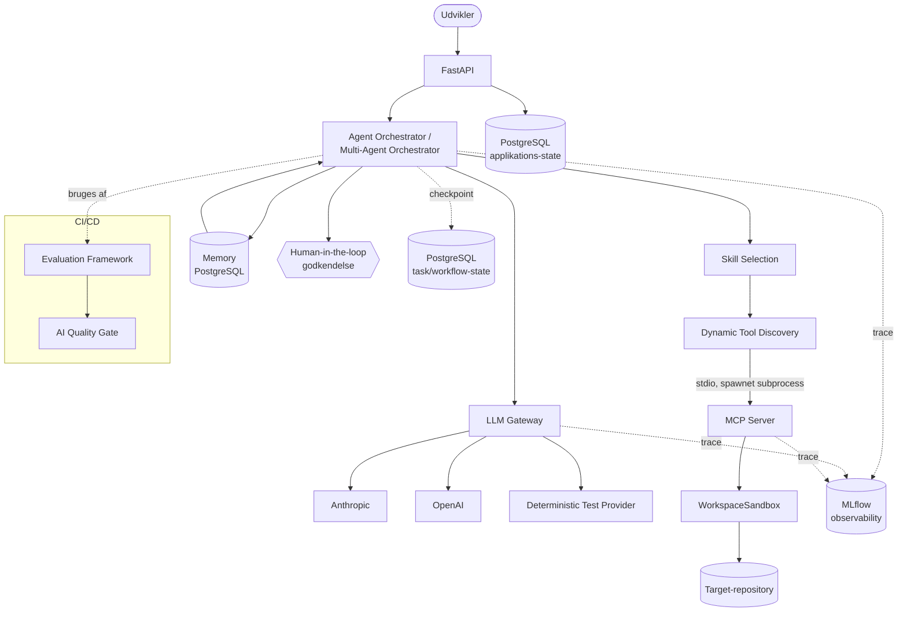

# Arkitektur

Dette dokument beskriver AgentOps Developer Platforms arkitektur: hvordan
komponenterne hænger sammen, og hvorfor de er designet, som de er.

## Overblik



**Læsevejledning:** en udvikler sender en opgave til FastAPI, som overdrager
den til Agent Orchestrator (eller Multi-Agent Orchestrator for et
flerfase-forløb). Orchestratoren henter relevant memory fra tidligere
opgaver i samme workspace, vælger en skill ud fra opgaveteksten, og
begrænser (valgfrit) hvilke MCP-tools modellen ser, før den beder LLM
Gateway'et om et modelsvar. MCP-serveren spawnes som en separat proces, hver
gang repositoryet skal undersøges eller ændres. Fremskridt gemmes løbende som
checkpoints i PostgreSQL, så en genstart ikke nødvendigvis taber arbejdet.
Alt logges som spans til MLflow. Operationel state (opgaver, workflows,
godkendelser, memory, evalueringsresultater) ligger i PostgreSQL — adskilt
fra MLflow's observability-data.

## Komponenter

### FastAPI (`src/agentops/api/`)

Eksponerer platformen som en HTTP-API: `POST /tasks` opretter og kører en
opgave, `POST /tasks/{id}/approve` godkender/afviser en afventende høj-risiko
handling, `GET /tasks/{id}/trace` viser de strukturerede events for en
kørsel, og `POST /evaluations/run` udløser benchmark-suiten. Se det fulde
kontraktoverblik i den auto-genererede OpenAPI-dokumentation (`/docs`, når
serveren kører).

En bevidst forenkling: `POST /tasks` kører agenten synkront inden for
HTTP-requestet. I en produktionsplatform med lange eller mange samtidige
kørsler ville dette flyttes til en baggrundsjobkø, og klienten ville polle
status — udeladt her, fordi det ville tilføje kompleksitet (en queue,
en worker-proces) uden at demonstrere noget nyt arkitektonisk princip for et
projekt af denne skala. Se `docs/adr/0007-synkron-task-eksekvering.md`.

### Agent Orchestrator (`src/agentops/agent/`)

Den agentiske løkke:

```
OPGAVE → system prompt (context-strategi) → LLM-kald → tool call? →
  ja → risk-vurdering → (godkendelse nødvendig? pause) → udfør tool → observation → LLM-kald igen
  nej → afsluttende svar
```

Repositoryet sendes ALDRIG i sin helhed til modellen. Hvilken kontekst
modellen starter med, afgøres af en eksplicit `ContextStrategy`
(`agentops.agent.context`):

| Strategi | System-prompt | Tools |
|---|---|---|
| A: `minimal` | Kun opgaveteksten | Ingen |
| B: `claude_md` | + CLAUDE.md fra target-repoet | Ingen |
| C: `targeted_mcp` | Samme som B | Fuld MCP-værktøjskasse |
| D: `optimized` | B + et forudberegnet repository-resumé | Fuld MCP-værktøjskasse |

Se `docs/experiments/` for de faktisk målte forskelle mellem strategierne.

Hvert trin logges som et `AgentEvent` — et struktureret objekt med tool-navn,
(redactede) argumenter, risikoniveau og en kort rationale. Modellens rå
chain-of-thought eksponeres aldrig; kun disse strukturerede beslutninger.

Høj-risiko tool calls (`edit_file`, `apply_patch`) stopper løkken og
returnerer status `awaiting_approval`. `AgentOrchestrator.resume()` genoptager
kørslen, når et menneske har godkendt eller afvist via API'et.

### Agent Memory (`src/agentops/memory/`)

Persistent, workspace-scoped hukommelse i PostgreSQL (tabel
`agent_memories`), der giver agenten adgang til erfaringer fra tidligere
opgaver i samme repository — ikke hele gamle samtaler. `extract_memories`
udtrækker højst tre poster PR. opgave (task-outcome, tool-effectiveness,
lesson-learned) UDELUKKENDE fra allerede-strukturerede felter i
`AgentRunResult` (`tools_used`, `files_changed`, `tests_passed/failed`) —
aldrig fra rå tool-output eller konversationstekst. Hver tekst køres gennem
`agentops.memory.sanitize`, som afviser kendte injection-mønstre og
markerer posten `flagged`; `MemoryStore.search` udelukker altid flagged
rækker, fail-closed. Orchestratoren kender ikke til SQLAlchemy direkte — den
modtager to almindelige async callables (`memory_retriever`, `memory_saver`),
samme mønster som `task_repository` bruges i API-laget. Se
[ADR-0013](adr/0013-agent-memory.md) og `docs/security.md` §9.

### Agent Skills (`src/agentops/agent/skills.py`)

Et modulært skills-system med indbyggede skills for debugging,
security-review, test-generation, database/migration-review og API-review.
`select_skill(task)` matcher opgaveteksten mod hver skills nøgleord
DETERMINISTISK, før noget LLM-kald sker — kun den vindende skill (hvis
nogen) tilføjes til system-prompten, aldrig alle skills på forhånd. En skill
er ren data (`Skill`-modellen): instruktioner, anbefalede MCP-tools,
sikkerhedsregler og checks. At tilføje en ny skill kræver kun én ny
`Skill`-instans i `SKILLS`-listen. Skill-indhold har ingen kodesti ind i
risikoklassificeringen — se `docs/security.md` §10.

### Dynamic MCP Tool Discovery (`src/agentops/agent/tool_discovery.py`)

Når `AGENT_DYNAMIC_TOOL_DISCOVERY=true`, sender orchestratoren ikke alle
MCP-tool-schemas til modellen fra start. `discover_relevant_tools` filtrerer
til den valgte skills `recommended_tools`, eller et nøgleords-fallback, hvis
ingen skill matchede. Matcher intet overhovedet, er politikken bevidst
**fail-open**: hele værktøjskassen returneres uændret — i modsætning til
risk-godkendelse, som er fail-closed. Det er kun hvilke SCHEMAS modellen ser,
der filtreres; selve godkendelsestjekket kører uændret på de tool calls,
modellen rent faktisk foretager (`docs/security.md` §12). Se målt
token-/tool-call-forskel i `docs/experiments/`.

### Long-running Tasks (checkpoints i `src/agentops/agent/orchestrator.py`)

En opgave behøver ikke afsluttes i ét sammenhængende kald. Efter hvert
agent-trin kaldes en `on_checkpoint`-callback, der committer
konversationstilstand og events til PostgreSQL med det samme (ikke kun
flush) — en API-genstart taber derfor ikke nødvendigvis fremskridt.
`max_continuous_steps` kan sætte en opgave på PAUSED (en ny `TaskStatus`,
adskilt fra `awaiting_approval`) efter et fast antal trin, og
`AgentOrchestrator.continue_task()` genoptager den. Ved opstart scanner
`recover_interrupted_tasks` for opgaver, der stod som `running`, da
processen sidst stoppede: findes et checkpoint, markeres opgaven `paused`
(klar til at blive fortsat via API'et); findes intet, markeres den `failed`.
Der sker ALDRIG automatisk genoptagelse uden en eksplicit
`POST /tasks/{id}/continue`. Se [ADR-0014](adr/0014-skills-tool-discovery-long-running.md).

### Multi-Agent Workflow (`src/agentops/agent/multi_agent.py`)

Et kontrolleret, ikke-cyklisk 4-fase-forløb — Developer → Test → Security →
Reviewer — bygget oven på den samme `AgentOrchestrator`, ikke en ny
agent-mekanisme. Hver fase er én afgrænset orchestrator-kørsel med sit eget
trin-budget. Developer-fasen løser opgaven og pauser for menneskelig
godkendelse ved høj-risiko handlinger, præcis som i enkelt-agent-flowet.
Test-fasen kører testsuiten uafhængigt. Security-fasen er bevidst **ikke**
et LLM-kald — den scanner den faktiske `git diff` deterministisk
(`agentops.agent.security_scan.scan_diff_for_issues`), så den ikke kan
"overtales" af tekst i en tidligere fases svar. Reviewer-fasen er en ren
Python-syntese af de andre fasers `success`-felter, ikke en fortolkning af
fri tekst. Der er ingen løkke mellem agenterne — forløbet har et fast antal
faser og en klar afslutningsregel. Hver fase logges som sit eget MLflow-span
under ét fælles `multi_agent_workflow`-span, så hele forløbet kan ses samlet
eller fase for fase. Se [ADR-0015](adr/0015-multi-agent-workflow.md) og
`docs/security.md` §11.

### MCP Server (`src/agentops/mcp_server/`)

En rigtig MCP-server bygget på den officielle `mcp` Python SDK (v2.x). Se
`docs/mcp.md` for tool-liste, schemas og hvordan Claude Code kan forbinde til
den. Vigtigt: MCP-serveren kører **ikke** som en separat netværksservice —
orchestratoren spawner den som en stdio-subprocess for hver agent-kørsel,
præcis som Claude Code selv ville gøre. Det er derfor der ikke er en separat
"mcp-server"-container i `compose.yaml`.

### LLM Gateway (`src/agentops/gateway/`)

Provider-uafhængigt interface (`LLMProvider`) med tre implementeringer:
`AnthropicProvider`, `OpenAIProvider`, og `DeterministicTestProvider`. Et
`ModelRouter` vælger provider+model ud fra opgavens `TaskComplexity`
(simpel/kompleks). `LLMGateway` lægger retries og normaliseret
fejlhåndtering oven på alt dette. Fallback ved et rigtigt providerudfald
går kun til en anden konfigureret rigtig provider (aldrig til
test-provideren) — se `docs/adr/0002-llm-gateway.md` og
`docs/adr/0012-gateway-fallback-adskillelse.md`.

### Persistence (`src/agentops/persistence/`)

PostgreSQL via synkron SQLAlchemy + Alembic-migrations. Holder operationel
state: opgaver, godkendelser, evalueringskørsler. Se
`docs/adr/0006-postgresql-persistence.md` for afvejningen mod async
SQLAlchemy og hvorfor dette er adskilt fra MLflow.

### Observability (`src/agentops/observability/`)

MLflow-tracing (manuelle spans omkring agent-kørsler, LLM-kald og tool-kald)
plus struktureret JSON-logging med automatisk secret-redaction
(`agentops.security.secrets`). Se `docs/adr/0004-mlflow-observability.md`.

### Evaluation Framework (`src/agentops/evaluation/`)

Kører benchmark-cases (`evals/fixtures/`) mod en rigtig agent-kørsel og måler
deterministiske metrics (tests bestået, antal tool calls, unødvendige
filændringer) — ikke en models egen selvvurdering. Resultater gemmes som
machine-readable JSON under `evals/results/` og kan sammenlignes på tværs af
kørsler. Se `docs/experiments/`.

### Security (`src/agentops/security/`)

Sandboxing, command allowlisting og secret-redaction. Se `docs/security.md`
for den fulde trusselsmodel.

## Hvad der IKKE er implementeret som separate netværkstjenester

- **MCP-serveren** kører som forklaret ovenfor som en subprocess, ikke en
  netværkstjeneste. Dette holder angrebsfladen lille: MCP-serveren kan kun
  nås af den proces, der spawnede den.
- **En jobkø til lange agent-kørsler** — se den synkrone eksekvering ovenfor.

## Skalering

Denne platform er dimensioneret til en demonstration, ikke til produktionslast.
Reelle skaleringstiltag ville inkludere: async SQLAlchemy eller en connection
pool tunet til samtidighed, en baggrunds-jobkø til agent-kørsler, horisontal
skalering af API-containere bag en load balancer (statsløs, da state ligger i
PostgreSQL), og rate limiting på LLM Gateway-niveau pr. bruger/tenant.
