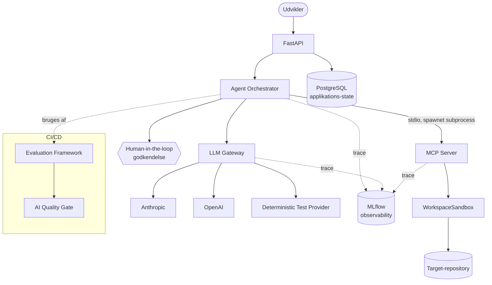

# Arkitektur

Dette dokument beskriver AgentOps Developer Platforms arkitektur: hvordan
komponenterne hænger sammen, og hvorfor de er designet, som de er.

## Overblik



**Læsevejledning:** en udvikler sender en opgave til FastAPI, som overdrager
den til Agent Orchestrator. Orchestratoren beder LLM Gateway'et om et
modelsvar og spawner MCP-serveren som en separat proces, hver gang den skal
undersøge eller ændre repositoryet. Alt logges som spans til MLflow.
Operationel state (opgaver, godkendelser, evalueringsresultater) ligger i
PostgreSQL — adskilt fra MLflow's observability-data.

## Komponenter

### FastAPI (`src/agentops/api/`)

Eksponerer platformen som en HTTP-API: `POST /tasks` opretter og kører en
opgave, `POST /tasks/{id}/approve` godkender/afviser en afventende høj-risiko
handling, `GET /tasks/{id}/trace` viser de strukturerede events for en
kørsel, og `POST /evaluations/run` udløser benchmark-suiten. Se det fulde
kontraktoverblik i den auto-genererede OpenAPI-dokumentation (`/docs`, når
serveren kører).

En bevidst forenkling: `POST /tasks` kører agenten synkront inden for
HTTP-requestet. I en produktionsplatform med lange eller mange samtidige
kørsler ville dette flyttes til en baggrundsjobkø, og klienten ville polle
status — udeladt her, fordi det ville tilføje kompleksitet (en queue,
en worker-proces) uden at demonstrere noget nyt arkitektonisk princip for et
projekt af denne skala. Se `docs/adr/0007-synkron-task-eksekvering.md`.

### Agent Orchestrator (`src/agentops/agent/`)

Den agentiske løkke:

```
OPGAVE → system prompt (context-strategi) → LLM-kald → tool call? →
  ja → risk-vurdering → (godkendelse nødvendig? pause) → udfør tool → observation → LLM-kald igen
  nej → afsluttende svar
```

Repositoryet sendes ALDRIG i sin helhed til modellen. Hvilken kontekst
modellen starter med, afgøres af en eksplicit `ContextStrategy`
(`agentops.agent.context`):

| Strategi | System-prompt | Tools |
|---|---|---|
| A: `minimal` | Kun opgaveteksten | Ingen |
| B: `claude_md` | + CLAUDE.md fra target-repoet | Ingen |
| C: `targeted_mcp` | Samme som B | Fuld MCP-værktøjskasse |
| D: `optimized` | B + et forudberegnet repository-resumé | Fuld MCP-værktøjskasse |

Se `docs/experiments/` for de faktisk målte forskelle mellem strategierne.

Hvert trin logges som et `AgentEvent` — et struktureret objekt med tool-navn,
(redactede) argumenter, risikoniveau og en kort rationale. Modellens rå
chain-of-thought eksponeres aldrig; kun disse strukturerede beslutninger.

Høj-risiko tool calls (`edit_file`, `apply_patch`) stopper løkken og
returnerer status `awaiting_approval`. `AgentOrchestrator.resume()` genoptager
kørslen, når et menneske har godkendt eller afvist via API'et.

### MCP Server (`src/agentops/mcp_server/`)

En rigtig MCP-server bygget på den officielle `mcp` Python SDK (v2.x). Se
`docs/mcp.md` for tool-liste, schemas og hvordan Claude Code kan forbinde til
den. Vigtigt: MCP-serveren kører **ikke** som en separat netværksservice —
orchestratoren spawner den som en stdio-subprocess for hver agent-kørsel,
præcis som Claude Code selv ville gøre. Det er derfor der ikke er en separat
"mcp-server"-container i `compose.yaml`.

### LLM Gateway (`src/agentops/gateway/`)

Provider-uafhængigt interface (`LLMProvider`) med tre implementeringer:
`AnthropicProvider`, `OpenAIProvider`, og `DeterministicTestProvider`. Et
`ModelRouter` vælger provider+model ud fra opgavens `TaskComplexity`
(simpel/kompleks). `LLMGateway` lægger retries og normaliseret
fejlhåndtering oven på alt dette. Fallback ved et rigtigt providerudfald
går kun til en anden konfigureret rigtig provider (aldrig til
test-provideren) — se `docs/adr/0002-llm-gateway.md` og
`docs/adr/0012-gateway-fallback-adskillelse.md`.

### Persistence (`src/agentops/persistence/`)

PostgreSQL via synkron SQLAlchemy + Alembic-migrations. Holder operationel
state: opgaver, godkendelser, evalueringskørsler. Se
`docs/adr/0006-postgresql-persistence.md` for afvejningen mod async
SQLAlchemy og hvorfor dette er adskilt fra MLflow.

### Observability (`src/agentops/observability/`)

MLflow-tracing (manuelle spans omkring agent-kørsler, LLM-kald og tool-kald)
plus struktureret JSON-logging med automatisk secret-redaction
(`agentops.security.secrets`). Se `docs/adr/0004-mlflow-observability.md`.

### Evaluation Framework (`src/agentops/evaluation/`)

Kører benchmark-cases (`evals/fixtures/`) mod en rigtig agent-kørsel og måler
deterministiske metrics (tests bestået, antal tool calls, unødvendige
filændringer) — ikke en models egen selvvurdering. Resultater gemmes som
machine-readable JSON under `evals/results/` og kan sammenlignes på tværs af
kørsler. Se `docs/experiments/`.

### Security (`src/agentops/security/`)

Sandboxing, command allowlisting og secret-redaction. Se `docs/security.md`
for den fulde trusselsmodel.

## Hvad der IKKE er implementeret som separate netværkstjenester

- **MCP-serveren** kører som forklaret ovenfor som en subprocess, ikke en
  netværkstjeneste. Dette holder angrebsfladen lille: MCP-serveren kan kun
  nås af den proces, der spawnede den.
- **En jobkø til lange agent-kørsler** — se den synkrone eksekvering ovenfor.

## Skalering

Denne platform er dimensioneret til en demonstration, ikke til produktionslast.
Reelle skaleringstiltag ville inkludere: async SQLAlchemy eller en connection
pool tunet til samtidighed, en baggrunds-jobkø til agent-kørsler, horisontal
skalering af API-containere bag en load balancer (statsløs, da state ligger i
PostgreSQL), og rate limiting på LLM Gateway-niveau pr. bruger/tenant.
